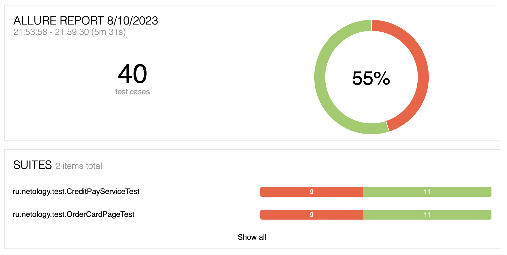
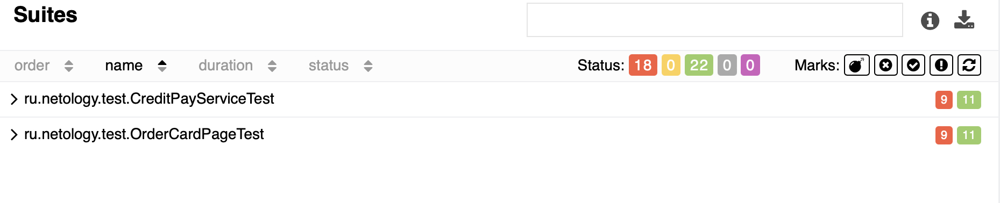
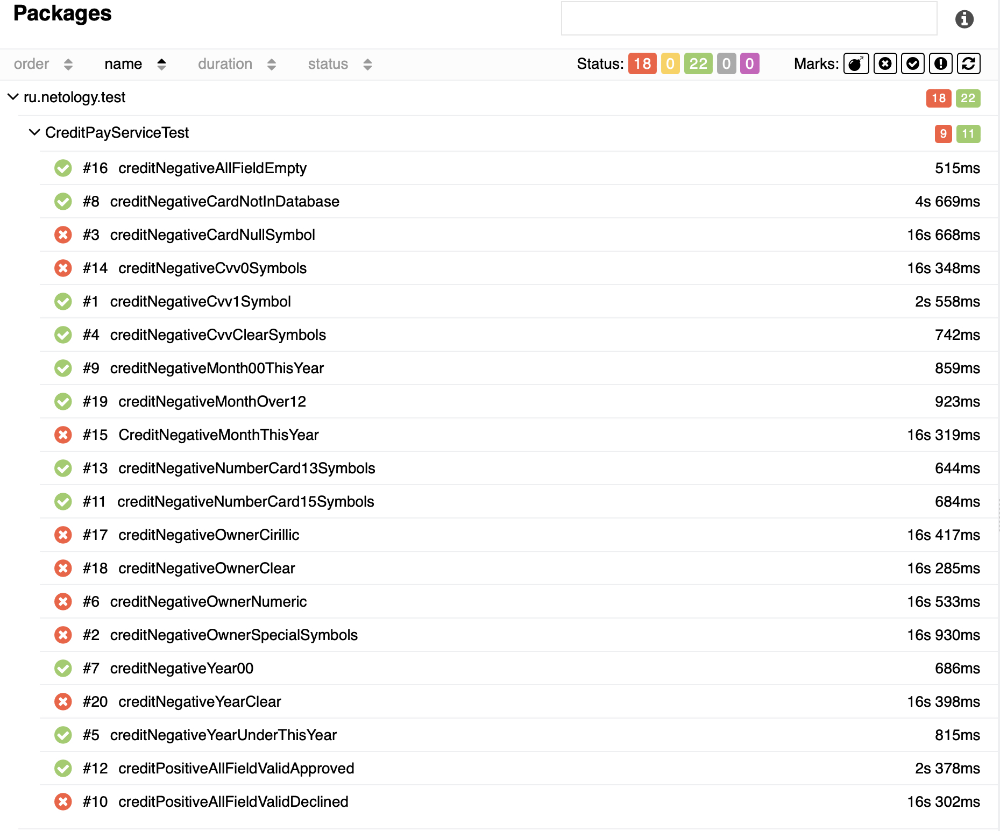
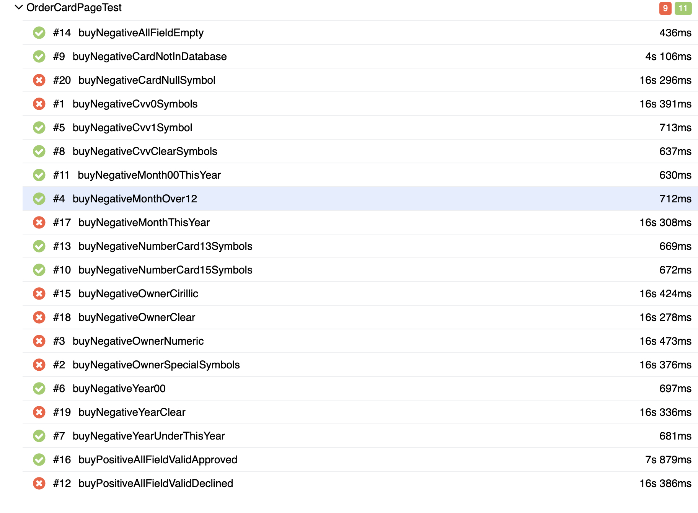

# Отчёт о проведённом тестировании:

Отчёт по результату автоматизированного тестированию функционала покупки и оформления кредита по данным карты веб-сервиса покупки тура
"Путешествие дня".

### Краткое описание:
Проведено тестирование веб-сервиса по покупке тура. Все тестовые сценарии автоматизированы. Проверены два варианта оплаты:
- по дебетовой карте (Купить)
- по кредитной карте (Купить в кредит)

Автоматизированные тесты были успешно запущены для двух СУБД:
- MySQL
- PostgreSQL

Всего составлено 40 тестов, из них:
- Успешных - 22 (55%)
- Неуспешных - 18 (45%)
- Проигнорировано: 0

Отчет по результатам тестирования Allure:
Отчёт Overview:

Отчёт Suites. CreditPageTest:

Результаты тестов по тестируемому функционалу:
CreditPayServiceTest

OrderCardPageTest

В результате прогона тестов было составлено 8 issue.

## Общие рекомендации

* Исправить орфографические ошибки
* Сложный поиск CSS Селекторов. Нужно создать уникальные для всей страницы (либо в конкретной её области) идентификаторы для элементов, собственные атрибуты с префиксом data-, например, data-id.
* Большинство багов не являются критичными. Система отображает ошибку при заполнении формы, но неправильно ее идентифицирует (вместо "Поле обязательно для заполнения" система отображает "Неверный формат")
* Для поля "Месяц" ввести ограничение на ввод данных. Сделать возможным ввод только цифровых значений от 01 до 12.
* Для поля "Владелец" ввести ограничение на ввод данных. Сделать возможным заполнение формы только на латинице, автоматически переводя буквы в верхний регистр. Спецсимволы и цифры вводить нельзя (дефис, пробел и апостроф допустимы).
